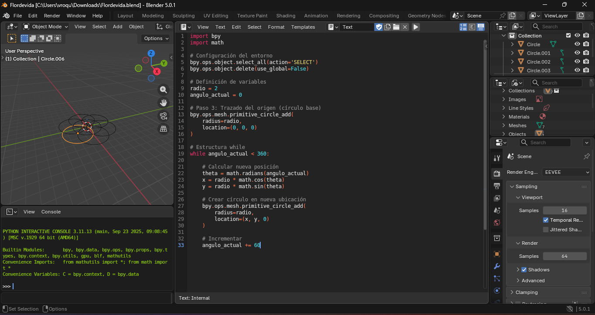

# PRACTICA - Flor de Vida en Blender con Python

## Introducción

En esta práctica se genera la figura geométrica conocida como **Flor de Vida** utilizando Python dentro de Blender mediante la API `bpy`.

La Flor de Vida es un patrón formado por círculos del mismo radio que se superponen de manera simétrica alrededor de un punto central.  
Su construcción se basa en cálculos trigonométricos que permiten distribuir los círculos uniformemente en el plano.

---

## Código en Python

```python
import bpy
import math

# Limpiar la escena
bpy.ops.object.select_all(action='SELECT')
bpy.ops.object.delete(use_global=False)

radio = 2
angulo_actual = 0

# Círculo central
bpy.ops.mesh.primitive_circle_add(
    radius=radio,
    location=(0, 0, 0)
)

# Crear círculos alrededor usando while
while angulo_actual < 360:
    theta = math.radians(angulo_actual)
    x = radio * math.cos(theta)
    y = radio * math.sin(theta)

    bpy.ops.mesh.primitive_circle_add(
        radius=radio,
        location=(x, y, 0)
    )

    angulo_actual += 60
```

---

## Explicación del Código

### 1. Importación de librerías

Se importa:

- `bpy` para interactuar con Blender.
- `math` para realizar operaciones matemáticas como seno, coseno y conversión de grados a radianes.

---

### 2. Limpieza de la escena

Antes de generar la figura, se eliminan todos los objetos existentes para trabajar en una escena vacía.

---

### 3. Creación del círculo central

Se genera un círculo en el origen (0,0,0), que servirá como base del patrón.

---

### 4. Uso de la estructura while

Se utiliza un ciclo `while` que se ejecuta hasta completar 360 grados.

En cada iteración:

- Se convierte el ángulo a radianes.
- Se calculan las coordenadas usando:

x = r cos(θ)  
y = r sen(θ)

Donde:
- r es el radio
- θ es el ángulo actual

Esto permite posicionar cada círculo alrededor del centro.

---

### 5. Formación del patrón

El ángulo aumenta en incrementos de 60°, lo que genera seis círculos distribuidos uniformemente alrededor del círculo central, formando la base de la Flor de Vida.

---
## Resultado en Blender



---

## Explicación

Se utiliza la fórmula matemática:

x = r cos(θ)  
y = r sen(θ)

El ángulo aumenta de 60 en 60 grados hasta completar 360°, generando seis círculos distribuidos uniformemente alrededor del círculo central.


## Conclusión

Este ejercicio demuestra cómo la programación y la trigonometría pueden utilizarse para crear patrones geométricos simétricos en Blender.  
La automatización mediante código permite generar figuras complejas con precisión matemática.
